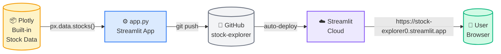

# 📈 Stock Explorer

A Streamlit app for exploring and comparing big tech stock performance since Jan 2018. Built with Plotly's built-in dataset — no downloads required.

## Live App

**[stock-explorer0.streamlit.app](https://stock-explorer0.streamlit.app/)**

## Features

- Compare up to 6 big tech stocks (AAPL, MSFT, GOOG, AMZN, NFLX, AAPL)
- Normalized price chart — all stocks indexed to 1.00 at Jan 2018
- Top grower banner and per-stock growth metrics
- Fully interactive Plotly chart (zoom, pan, download)

## Architecture



## Run Locally

```bash
python -m pip install -r requirements.txt
streamlit run app.py
```
